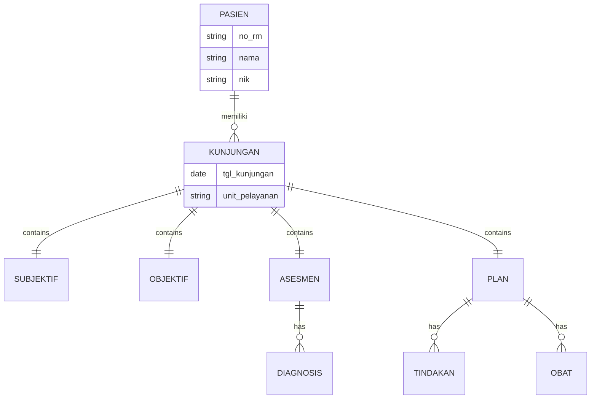

# Klinikin by Dikodein

**Sistem Informasi Manajemen Klinik & Rekam Medis Elektronik (RME)**


## 📋 Tentang Aplikasi

**Klinikin by Dikodein** adalah solusi komprehensif untuk manajemen klinik modern. Aplikasi ini dirancang untuk mendigitalisasi seluruh proses operasional klinik, mulai dari pendaftaran pasien secara mandiri (APM), manajemen rekam medis elektronik (RME), hingga pengelolaan data mahasiswa dan dosen untuk klinik pendidikan.

Dibangun dengan teknologi web modern, aplikasi ini menawarkan performa tinggi, antarmuka yang intuitif, dan fitur keamanan data yang handal.

## 🚀 Fitur Unggulan

### 1. 🖥️ Anjungan Pendaftaran Mandiri (APM)
Memudahkan pasien untuk mendaftar tanpa antri di loket.
- **Pendaftaran Pasien Baru & Lama**: Alur terpisah untuk efisiensi.
- **Real-time Queue Display**: Menampilkan status antrian (Menunggu/Dipanggil) secara langsung.
- **Cetak Nomor Antrian**: Integrasi langsung dengan printer thermal/standar.
- **Info Fasyankes**: Menampilkan nama klinik, tanggal, dan jam secara real-time.

### 2. 🏥 Rekam Medis Elektronik (RME)
Pencatatan medis yang lengkap dan terstandarisasi.
- **SOAP Format**: Subjektif, Objektif, Asesmen, Plan.
- **Riwayat Medis**: Akses mudah ke riwayat kunjungan pasien sebelumnya.
- **Cetak Resume Medis**: Template cetak standar (ukuran F4) dengan layout profesional.

### 3. 👥 Manajemen Pasien & Pengguna
- **Database Pasien**: Pencarian cepat berdasarkan No. RM, NIK, atau BPJS.
- **Manajemen Mahasiswa & Dosen**: Fitur khusus untuk klinik pendidikan/kampus.
- **Role-based Access**: Akses berbeda untuk Admin, Dokter/Dosen, dan Mahasiswa.

### 4. ⚙️ Pengaturan & Utilitas
- **Manajemen Fasilitas**: Ubah nama, logo, dan profil klinik dengan mudah.
- **Running Text**: Pengaturan teks berjalan untuk informasi di ruang tunggu.
- **Keamanan Data**: Enkripsi data sensitif dan manajemen sesi yang aman.

## 🛠️ Teknologi yang Digunakan

- **Frontend**: [React](https://reactjs.org/) + [TypeScript](https://www.typescriptlang.org/)
- **Build Tool**: [Vite](https://vitejs.dev/) (Super fast build times)
- **Styling**: [Tailwind CSS](https://tailwindcss.com/) + [Shadcn UI](https://ui.shadcn.com/)
- **Icons**: [Lucide React](https://lucide.dev/)
- **Backend/Database**: [Supabase](https://supabase.com/) (PostgreSQL)
- **State Management**: React Hooks & Context

## 📂 Struktur Proyek

```
src/
├── components/     # Komponen UI reusable (Button, Input, Card, dll)
│   ├── layout/     # Komponen layout (Header, Sidebar, Footer)
│   ├── print/      # Template khusus untuk cetak dokumen
│   └── ui/         # Komponen dasar dari Shadcn UI
├── pages/          # Halaman-halaman utama aplikasi
├── services/       # Logika bisnis dan komunikasi API (Supabase)
├── types/          # Definisi tipe TypeScript (Interfaces/Types)
├── lib/            # Utilitas dan konfigurasi library (e.g., supabase client)
└── hooks/          # Custom React Hooks
```

## 🚀 Cara Menjalankan (Getting Started)

Ikuti langkah-langkah berikut untuk menjalankan proyek di komputer lokal Anda.

### Prasyarat
- [Node.js](https://nodejs.org/) (Versi 16 atau lebih baru)
- [NPM](https://www.npmjs.com/) atau Yarn

### Instalasi

1.  **Clone Repository**
    ```bash
    git clone https://github.com/username/klinikin-by-dikodein.git
    cd klinikin-by-dikodein
    ```

2.  **Install Dependencies**
    ```bash
    npm install
    ```

3.  **Konfigurasi Environment Variables**
    Salin file `.env.example` menjadi `.env` dan isi dengan kredensial Supabase Anda.
    ```bash
    cp .env.example .env
    ```
    Isi file `.env`:
    ```env
    VITE_SUPABASE_URL=your_supabase_url
    VITE_SUPABASE_ANON_KEY=your_supabase_anon_key
    ```

4.  **Jalankan Aplikasi**
    ```bash
    npm run dev
    ```
    Akses aplikasi di `http://localhost:5173`.

## 🔑 Akun Demo (Testing)

Gunakan akun berikut untuk mencoba fitur aplikasi:

| Role | Username / Email | Password |
| :--- | :--- | :--- |
| **Admin** | `admin@rme.com` | `admin123` |
| **Dosen** | `dosen1@rme.com` | `dosen123` |
| **Mahasiswa** | `mahasiswa1@rme.com` | `mhs123` |

## 📄 Lisensi

Hak Cipta © 2024 **Klinikin by Dikodein**. Seluruh hak cipta dilindungi undang-undang.
Dilarang keras menyalin, memodifikasi, atau mendistribusikan ulang tanpa izin tertulis.

---
*Dibuat dengan ❤️ oleh Tim Dikodein*

## 🔄 Alur Data (Data Flow)

Berikut adalah gambaran bagaimana data mengalir dalam sistem **Klinikin by Dikodein**:

1.  **Pendaftaran (Registration)**
    *   Pasien datang dan mendaftar melalui **APM (Anjungan Pendaftaran Mandiri)** atau loket.
    *   Data pasien disimpan di tabel `identitas_pasien`.
    *   Sistem membuat tiket antrian di tabel `antrian` (queue).
    *   Data kunjungan awal dicatat di tabel `kunjungan_resume`.

2.  **Pemeriksaan (Examination)**
    *   Dokter/Perawat memanggil pasien berdasarkan nomor antrian.
    *   Tenaga medis mengisi rekam medis dengan metode **SOAP**:
        *   **S (Subjective)**: Keluhan utama, riwayat penyakit (tabel `soap_subjektif`).
        *   **O (Objective)**: Tanda vital, fisik (tabel `soap_objektif`).
        *   **A (Assessment)**: Diagnosis ICD-10 (tabel `soap_asesmen_diagnosis` & `diagnosis`).
        *   **P (Plan)**: Rencana terapi, resep obat, tindakan (tabel `soap_plan`, `terapi_obat`, `tindakan_medis`).

3.  **Penunjang & Hasil**
    *   Jika ada pemeriksaan lab/radiologi, data disimpan di `pemeriksaan_penunjang`.

4.  **Output & Laporan**
    *   Data dari seluruh tabel di atas dikompilasi untuk mencetak **Resume Medis** atau laporan kunjungan.

## 💾 Skema Database

Sistem menggunakan database relasional (PostgreSQL via Supabase) dengan tabel-tabel utama sebagai berikut:

### Tabel Utama

| Nama Tabel | Deskripsi | Relasi Utama |
| :--- | :--- | :--- |
| `users` | Data pengguna sistem (Admin, Dosen, Mahasiswa). | - |
| `identitas_pasien` | Data demografis pasien (NIK, RM, Nama, dll). | `id_pasien` (PK) |
| `kunjungan_resume` | Header transaksi kunjungan pasien. | `id_pasien` (FK) |
| `profil_fasyankes` | Konfigurasi profil klinik (Nama, Logo, Alamat). | - |

### Tabel Rekam Medis (SOAP)

Seluruh tabel ini berelasi dengan `kunjungan_resume` melalui `id_kunjungan`.

| Nama Tabel | Deskripsi |
| :--- | :--- |
| `soap_subjektif` | Keluhan utama, RPS, RPD, Alergi. |
| `soap_objektif` | Tanda vital (Tensi, Suhu, Nadi), BB/TB. |
| `soap_asesmen_diagnosis` | Header diagnosis. |
| `diagnosis` | Detail diagnosis (Kode ICD-10). Relasi ke `soap_asesmen_diagnosis`. |
| `soap_plan` | Header rencana penatalaksanaan. |
| `tindakan_medis` | Detail tindakan yang dilakukan. Relasi ke `soap_plan`. |
| `terapi_obat` | Detail resep obat. Relasi ke `soap_plan`. |
| `pemeriksaan_penunjang` | File hasil lab/radiologi. |

### Diagram Relasi Sederhana (ERD)


